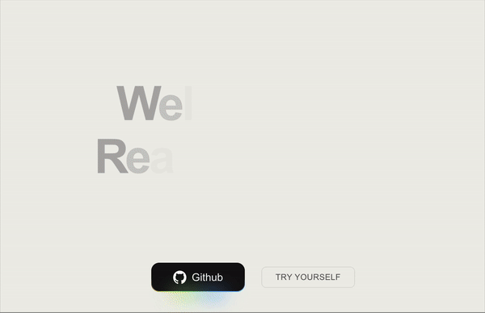

<a href="https://react-fox-toast.vercel.app/">
<p align="center">
  
</p>
</a>

<div align="center">
  
   
     
     
</div>
<div align="center">
  
</div>
<br />
<div align="center">
<h2>
<a href="https://react-fox-toast.vercel.app/">
    <strong>Click to Try the Demo!</strong>
</a>
</h2>
</div>
<br />

<!-- [](https://katherineoelsner.com/) -->

# React Fox Toast - Toast for ReactJS and NextJS

`react-fox-toast` is a flexible, customizable, and easy-to-use toast/notification bar component for ReactJS and NextJS. It supports various customization options, including styles, classes, icons, expandable content, and even integrates with libraries like TailwindCSS.

> **_NOTE:_** : this package works only on Client Side . So if using any SSR frameworks like NEXT.JS see to it that you have 'use client'; on top of component

## Features
- **Highly Customizable**: You can customize the position, duration, content, icons, and more.
- **Supports Promises**: Show success/error messages based on the result of promises.
- **Custom Content**: Render custom components inside the toast.
- **Global Toast Container**: A single container to manage toasts globally.
- **TailwindCSS Support**: Works seamlessly with TailwindCSS for styling.
- **Pause on Hover**: Pauses the toast’s auto-dismiss timer when the user hovers over it for better control.
- **Expandable Toasts**: Click to expand and reveal more content when there’s additional information to display.
- **Global Theme Support**: Easily apply a global theme to your toasts for consistent styling across your app.
- **Super Lightweight**: The lightest toast solution available, with minimal impact on your app’s performance.
- **Smooth Transitions**: Enjoy smooth and simple transitions for toast animations, including expand, slide in, and slide out effects.

## Installation

First, install the package via npm or yarn or pnpm:

```bash
npm install react-fox-toast
# or
yarn add react-fox-toast
# or
pnpm add react-fox-toast
```

## Setup

### Step 1: Add ToastContainer to your Root Component

To enable toast notifications in your app, wrap your root component with ToastContainer. This will allow the toasts to be displayed anywhere within your component tree.


```typescript
'use client'; //Add if you are using NextJs

import { ToastContainer } from "react-fox-toast";

function App() {
  return (
    <div>
      <ToastContainer />
    </div>
  );
}

export default App;
```

### Step 2: Use the toast Hook in Your Components
To display toasts, use the toast hook inside your components. This hook gives you access to toast functions like toast.success(), toast.error(), and more.

```typescript
'use client'; //Add if you are using NextJs

import { toast } from "react-fox-toast";

function MyComponent() {

  const showToast = () => {
    toast.success("Success! The action was completed.");
  };

  return <button onClick={showToast}>Show Success Toast</button>;
}
```
## Toast Types
The following types of toasts are available:

## 1. Success Toast
To display a success message:


```typescript
toast.success("Operation Successful!");
```

## 2. Error Toast
To display an error message:


```typescript
toast.error("Something went wrong!");
```

## 3. Info Toast
To display an informational message:


```typescript
toast.info("This is some information.");
```

## 4. Promise Toast
To display loading, success, or error states based on a promise:


```typescript
toast.promise(
  fetchData(), // Your promise function
  {
    loading: 'Loading data...',
    success: 'Data loaded successfully!',
    error: 'Failed to load data!',
  }
);
```

## 5. Custom Toast
You can create fully customized toasts by passing React components as content:

```typescript

toast.custom(
  ({ update, remove, dismiss }) => (
    <div className="flex flex-col items-center">
      
      <span>This is a toast with custom content!</span>

      /** Example on how to Update functionality inside the toast  */
      <button
        onClick={() => update({ message: 'Updated message with different width!' })}
        className="mt-2 px-2 py-1 bg-blue-100 text-black rounded"
      >
        Update
      </button>

      /** Example on how to remove functionality inside the toast  */
      <button
        onClick={() => remove()}
        className="mt-2 px-2 py-1 bg-red-200 text-black rounded"
      >
        Close
      </button>

      /** Example on how to remove all functionality inside the toast  */
      <button
        onClick={() => dismiss()}
        className="mt-2 px-2 py-1 bg-red-300 text-black rounded"
      >
        Dismiss All
      </button>
    </div>
  ),
  {
    position: 'top-right',
    duration: Infinity,
  }
);
```

## Customization
- You can pass additional customization options as the 2nd parameter for all toast types (success, error, info, promise, custom). These options include:

Customization Options

```typescript

const TOAST_TYPE = "success" // You can use options to toast types like 'success' , 'error', 'custom' ,'info'

toast.[TOAST_TYPE](MESSAGE,
{
  position: 'top-left', // Position of the toast. Options: 'top-left', 'top-right', 'top-center', 'bottom-left', 'bottom-right', 'bottom-center'
  duration: 5000, // Duration in milliseconds. Set to `Infinity` for indefinite display.
  isCloseBtn: true, // Whether to show the default close button.
  expandedContent: ( // Custom content that appears when the toast is clicked.
    <>
      <div>Here are some additional details for the toast.</div>
      <div>Click to expand for more info.</div>
    </>
  ),
  className: 'text-black', // Additional CSS classes (e.g., TailwindCSS classes).
  icon: <span className="text-purple-500 text-xl">🚀</span> // Custom icon (can be any JSX).
  }
)
```
### Example with Customization

```typescript
toast.success("Operation Successful!", {
  position: 'bottom-center',
  duration: 3000,
  isCloseBtn: true,
  expandedContent: (
    <>
      <div>Here are some additional details for the success toast.</div>
    </>
  ),
  className: 'text-green-500',
  icon: <span className="text-green-500 text-xl">✔️</span>,
});
```

### Dynamic Updates and Removal
You can also update or remove toasts dynamically using the toast.update(), toast.remove(), and toast.dismiss() methods.

Update a Toast: Update an existing toast with a new message or other options.

```typescript
const toastid = toast.success("Initial success message");

toast.update(toastid, 
             { message: "Updated success message", position: "top-right" });
             
// Remove a Toast: Remove a specific toast by its ID.
toast.remove(toastid);

// Dismiss All Toasts: Close all open toasts at once.
toast.dismiss();
```

### Support for JSX (React Components) in Toast Messages
In addition to using simple strings, you can now also pass JSX components (React elements) as content inside toast.success(), toast.error(), toast.info(), etc. This allows you to have more complex and dynamic content inside your toasts.

Example with JSX Content

```typescript
toast.success(
  <>
    <div className="text-lg font-bold">Operation Successful!</div>
    <div className="text-sm">Your action was completed without any issues.</div>
  </>,
  {
    position: 'top-right',
    duration: 3000,
    isCloseBtn: true,
    icon: <span className="text-green-500 text-xl">✔️</span>,
  }
);

```


### Example Usage
Here's a complete example showing how to use the toast notifications in a React component:
```typescript
'use client'; //Add if you are using NextJs

import React from 'react';
import { useToast } from 'react-fox-toast';

function App() {
  const toast = useToast();

  const showSuccessToast = () => {
    toast.success("Operation completed successfully!", {
      position: 'top-right',
      duration: 3000,
      isCloseBtn: true,
    });
  };

  const showErrorToast = () => {
    toast.error("Something went wrong!", {
      position: 'bottom-left',
      duration: 5000,
      icon: <span className="text-red-500 text-xl">❌</span>,
    });
  };

  return (
    <div>
      <button onClick={showSuccessToast}>Show Success Toast</button>
      <button onClick={showErrorToast}>Show Error Toast</button>
    </div>
  );
}

export default App;
```

## Theming Globally
 You can globally theme your default toast in ToastContainer, while still allowing custom styles for specific toast types like success, error, or info.


### Example Usage
```tsx
<ToastContainer 

  <! -- Add for global theming -->
   toastTypeTheming = {{
     success: {
      style: {
        backgroundColor: 'blue',
        color: '#155E00',
      },
       className: 'bg-blue-10'
     },
     error: {
       style: {
         backgroundColor: 'green',
         color: '#B91C1C',
       },
       className: 'error-toast-class',
     },
     info: {
       style: {
         backgroundColor: '#white',
         color: '#1D4ED8',
       },
       className: 'info-toast-class',
     },
     custom: {
       style: {
         backgroundColor: 'yellow',
         color: '#6B7280',
       },
       className: 'custom-toast-class',
     },
   }}
/> 
```
## Conclusion
react-fox-toast is a powerful and customizable toast notification library for ReactJS and NextJS. With features like promise-based toasts, custom content, expandable details, and full control over appearance and behavior, it offers a flexible solution for showing notifications in your app.

Feel free to modify and extend the functionality to suit your needs, and enjoy the seamless integration with libraries like TailwindCSS!

License: MIT License

For any questions or feedback, feel free to open an issue or contribute on GitHub!


### How to Use

1. **Copy the content** of this README.md into a file called `README.md` in your project directory.
2. **Modify** any additional details you want to customize or add to the setup.
3. **Distribute** the README file as part of your project repository.

Let me know if you'd like a different format or further customization!
